# Airbnb Open Data Analysis

## Project Overview

This project performs **data cleaning, exploratory data analysis (EDA), and visualization** on an Airbnb listings dataset.

The analysis uses Python to understand listing prices, room types, neighbourhood groups, reviews, availability, cancellation policies, instant booking, host verification, and estimated minimum-stay booking value.

The original notebook contains the complete step-by-step analysis and visualizations.

## Dataset

The notebook expects the dataset file:

```text
Airbnb_Open_Data.csv
```

The dataset contains **102,599 rows and 26 columns** before cleaning.

After removing duplicate rows, the dataset contains **102,058 rows and 26 columns**.

> **Note:** The CSV file is not included in this repository section unless you add it separately. Place `Airbnb_Open_Data.csv` in the working directory or update the file path in the notebook.

---

## Technologies Used

- **Python 3**
- **Pandas** – data loading, cleaning, grouping and analysis
- **Matplotlib** – data visualization
- **Google Colab / Jupyter Notebook** – development environment

---

## Project Workflow

```text
Load Dataset
     ↓
Inspect Dataset
     ↓
Check Missing Values
     ↓
Clean Data Types
     ↓
Handle Missing Values
     ↓
Remove Duplicate Rows
     ↓
Fix Invalid Values
     ↓
Correct Category Names
     ↓
Exploratory Data Analysis
     ↓
Create Derived Metrics
     ↓
Create Visualizations
     ↓
Final Summary
```

---

# Step-by-Step Process

## 1. Import and Load the Dataset

The project starts by importing Pandas and reading the CSV file.

```python
import pandas as pd

df = pd.read_csv(
    "Airbnb_Open_Data.csv",
    low_memory=False
)
```

The initial dataset contains:

- **102,599 rows**
- **26 columns**

The first few rows are also displayed to understand the structure of the data.

---

## 2. Check Missing Values

Missing values are counted for every column using:

```python
missing_values = df.isnull().sum()
print(missing_values)
```

Important missing-value observations include:

- `NAME` – 250
- `host name` – 406
- `country` – 532
- `price` – 247
- `service fee` – 273
- `last review` – 15,893
- `reviews per month` – 15,879
- `house_rules` – 52,131
- `license` – 102,597

This step helps identify which columns require cleaning.

---

## 3. Convert Price and Service Fee to Numeric Values

The `price` and `service fee` columns initially contain values such as `$193`.

The `$` symbol, commas, and extra spaces are removed before converting the columns to numeric values.

```python
df['price'] = (
    df['price']
    .astype(str)
    .str.replace('$', '', regex=False)
    .str.replace(',', '', regex=False)
    .str.strip()
)

df['service fee'] = (
    df['service fee']
    .astype(str)
    .str.replace('$', '', regex=False)
    .str.replace(',', '', regex=False)
    .str.strip()
)

df['price'] = pd.to_numeric(df['price'], errors='coerce')
df['service fee'] = pd.to_numeric(df['service fee'], errors='coerce')
```

---

## 4. Handle Missing Values

### Numerical columns

Missing numerical values are filled using the **median** of each column.

```python
for col in numeric_columns:
    df[col] = df[col].fillna(df[col].median())
```

### Categorical columns

Missing categorical values are filled using the **mode**.

```python
for col in categorical_columns:
    df[col] = df[col].fillna(df[col].mode()[0])
```

The `last review` column is converted into a date:

```python
df['last review'] = pd.to_datetime(
    df['last review'],
    errors='coerce'
)
```

The notebook intentionally leaves missing values in fields such as `house_rules`, `license`, and `last review` where they were not included in the categorical/numerical filling lists.

---

## 5. Check and Remove Duplicate Rows

The notebook checks for duplicate records:

```python
print(df.duplicated().sum())
```

It finds:

**541 duplicate rows**

They are removed using:

```python
df = df.drop_duplicates()
```

The dataset becomes:

**102,058 rows × 26 columns**

---

## 6. Check Numerical Statistics

The project uses `describe()` to examine important numerical variables.

The analysis includes:

- Price
- Service fee
- Minimum nights
- Number of reviews
- Review rating
- Availability

This step helps identify unusual values and possible data-quality problems.

---

## 7. Fix Invalid Values

Several invalid values are corrected.

### Minimum nights

Values below 1 are replaced with the median.

Values above 365 are also replaced with the median.

```python
df.loc[
    df['minimum nights'] < 1,
    'minimum nights'
] = df['minimum nights'].median()

df.loc[
    df['minimum nights'] > 365,
    'minimum nights'
] = df['minimum nights'].median()
```

### Availability

Availability is restricted to the range **0–365 days**.

```python
df.loc[
    df['availability 365'] < 0,
    'availability 365'
] = 0

df.loc[
    df['availability 365'] > 365,
    'availability 365'
] = 365
```

---

## 8. Correct Neighbourhood Group Names

The dataset contains spelling inconsistencies:

- `brookln`
- `manhatan`

They are corrected to:

- `Brooklyn`
- `Manhattan`

```python
df['neighbourhood group'] = df['neighbourhood group'].replace({
    'brookln': 'Brooklyn',
    'manhatan': 'Manhattan'
})
```

This prevents the same neighbourhood group from being treated as two different categories.

---

# Exploratory Data Analysis

## 9. Listings by Room Type

The project counts listings for each room type.

The four room types are:

- Entire home/apt
- Private room
- Shared room
- Hotel room

The dataset output shows that **Entire home/apt** has the largest number of listings.

---

## 10. Listings by Neighbourhood Group

The project counts listings in each neighbourhood group.

The main groups are:

- Manhattan
- Brooklyn
- Queens
- Bronx
- Staten Island

The output shows that Manhattan and Brooklyn contain the largest number of listings.

---

## 11. Average Price by Neighbourhood Group

Average listing price is calculated using:

```python
df.groupby(
    'neighbourhood group'
)['price'].mean()
```

After correcting spelling inconsistencies, the calculated averages are approximately:

| Neighbourhood Group | Average Price |
|---|---:|
| Queens | $630.20 |
| Bronx | $627.76 |
| Brooklyn | $626.50 |
| Staten Island | $623.99 |
| Manhattan | $622.67 |

These values describe the cleaned dataset used in the notebook.

---

## 12. Average Price by Room Type

The project compares the average price of different room types.

The notebook calculates:

```python
avg_price_room = (
    df.groupby('room type')['price']
    .mean()
    .sort_values(ascending=False)
)
```

The output is approximately:

| Room Type | Average Price |
|---|---:|
| Hotel room | $666.39 |
| Shared room | $634.79 |
| Entire home/apt | $625.24 |
| Private room | $624.93 |

---

## 13. Average Reviews by Room Type

The project also compares the average number of reviews for each room type.

The output is approximately:

| Room Type | Average Reviews |
|---|---:|
| Hotel room | 84.08 |
| Private room | 27.79 |
| Entire home/apt | 27.39 |
| Shared room | 20.31 |

---

# Visualizations

The notebook contains several graphs. The most useful representative graphs are included below.

## Price vs Number of Reviews

This scatter plot examines the relationship between listing price and number of reviews.

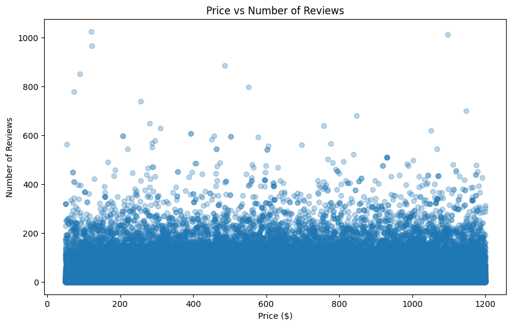

---

## Distribution of Airbnb Listing Prices

This histogram shows how listing prices are distributed across the dataset.

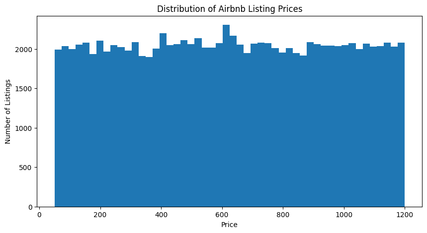

---

## Price vs Availability

This scatter plot compares listing price with the number of available days per year.

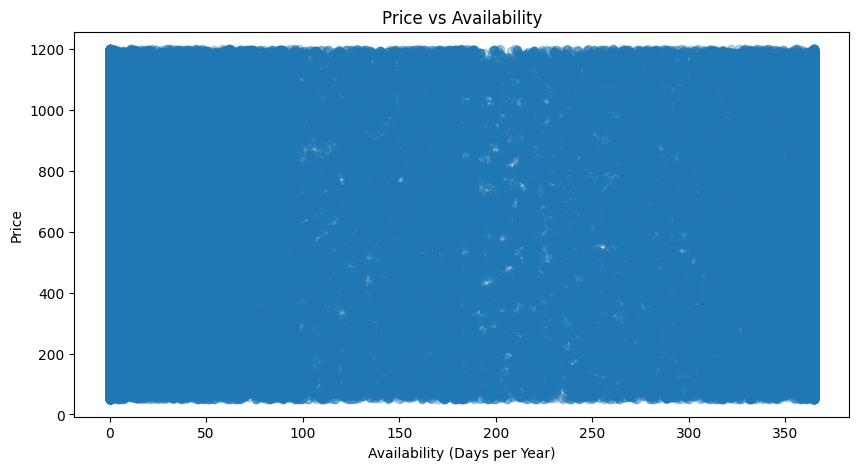

---

## Average Reviews by Neighbourhood Group

This chart compares the average number of reviews across neighbourhood groups.

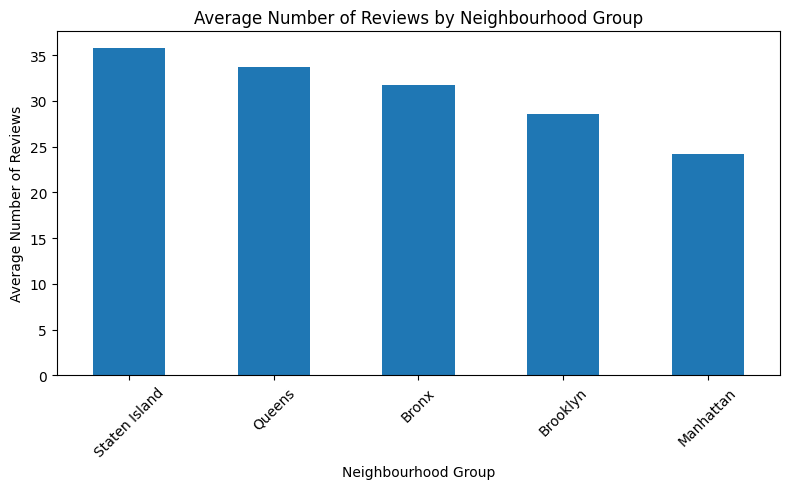

---

## Average Review Rating by Neighbourhood Group

This visualization compares average review ratings across neighbourhood groups.

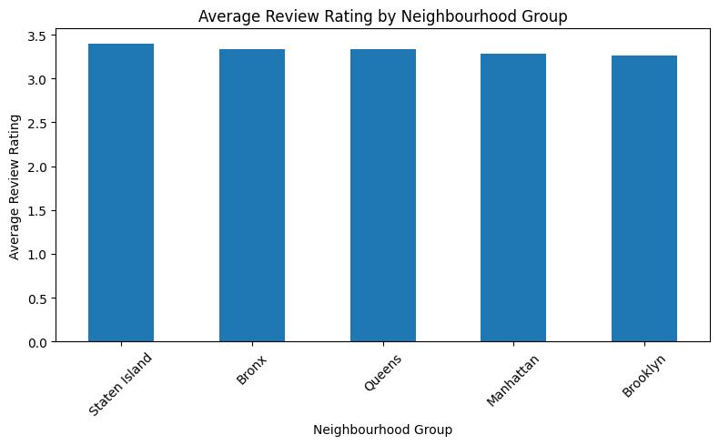

---

## Average Minimum Nights by Neighbourhood Group

This graph compares the average minimum stay requirement across neighbourhood groups.

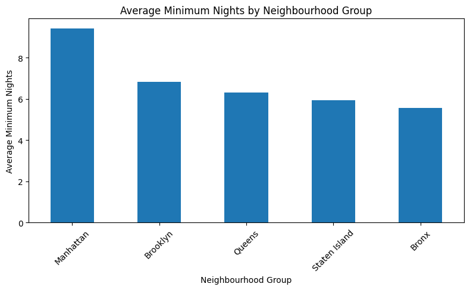

---

## Average Price by Room Type and Neighbourhood Group

This grouped bar chart compares prices using two categories:

- Room type
- Neighbourhood group

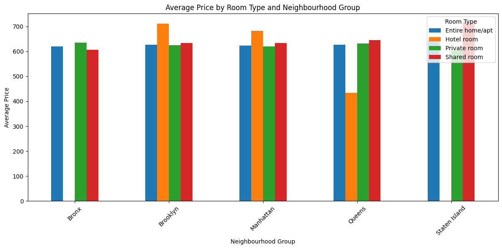

---

## Instant Booking Availability

The project compares listings that allow instant booking with those that do not.

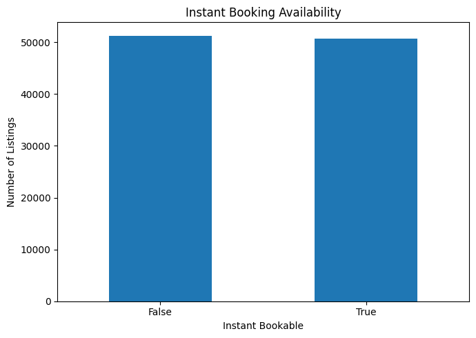

---

## Instant Booking by Cancellation Policy

This chart compares instant-booking availability across cancellation policies.

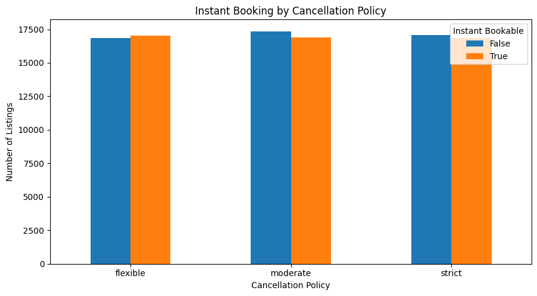

---

## Availability vs Minimum Nights

The project examines how average availability changes for different minimum-night requirements.

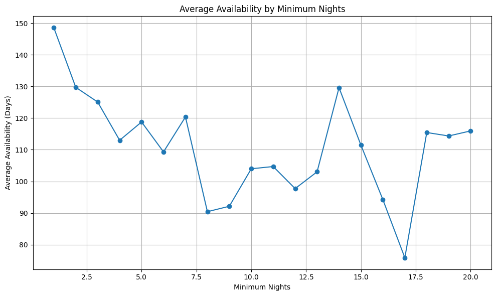

---

## Top 10 Hosts by Number of Listings

The project identifies the top hosts based on the number of listings in the dataset.

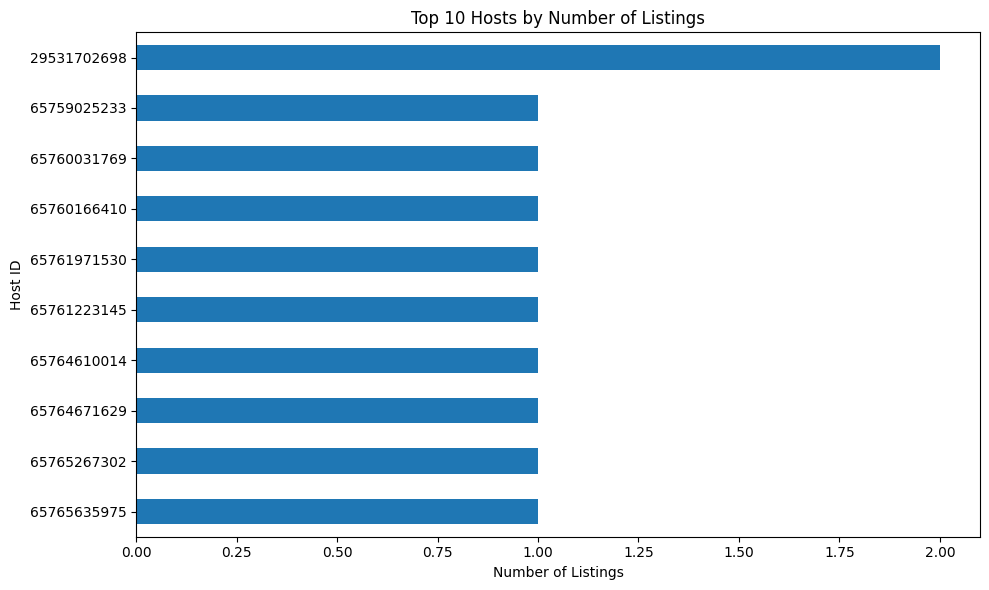

---

## Estimated Booking Value by Room Type

A derived variable is created:

```python
df['estimated_booking_value'] = (
    df['price'] * df['minimum nights']
)
```

This represents the **estimated value of one minimum-length stay based on the listed price and minimum nights**.

It should not be interpreted as actual revenue.

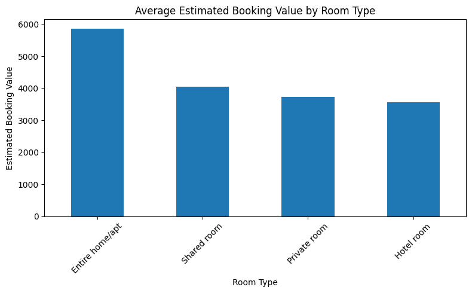

---

## Average Price by Host Identity Verification

This graph compares average listing price across host identity verification categories.

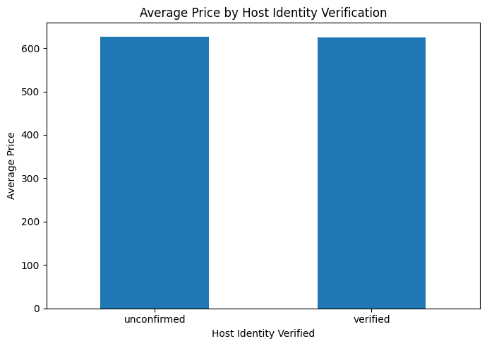

---

## Average Price by Cancellation Policy and Host Verification

This visualization combines cancellation policy and host identity verification to compare average prices.

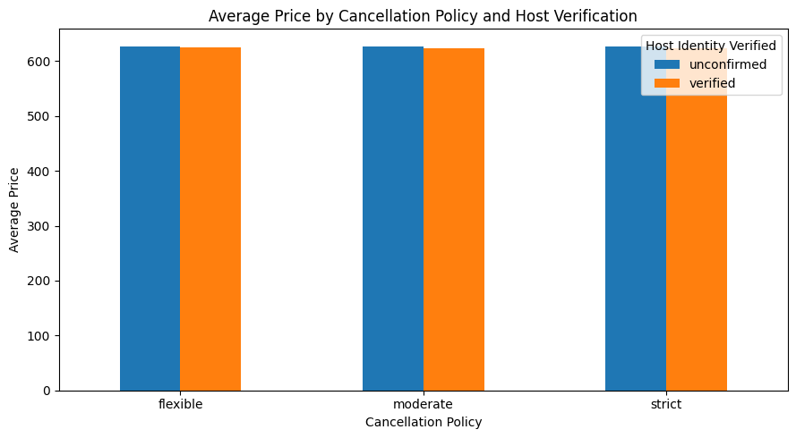

---

# Additional Analysis Performed

The notebook also calculates:

- Top 10 neighbourhoods by number of listings
- Top 10 neighbourhoods by average price
- Top 10 neighbourhoods by average review rating
- Top hosts by listing count
- Cancellation policy distribution
- Instant booking distribution
- Average price by cancellation policy
- Median price by neighbourhood group
- Average availability by room type
- Average availability by neighbourhood group
- Average price by room type and neighbourhood group
- Average rating by room type
- Average minimum nights by room type
- Top 10 listings by estimated minimum-stay booking value
- Review counts by year
- Average price by host verification
- Price by cancellation policy and host verification

---

# Review-Year Cleaning

The project extracts the year from the `last review` date:

```python
df['review_year'] = df['last review'].dt.year
```

The notebook identifies future review years and removes years greater than **2022**:

```python
df.loc[
    df['review_year'] > 2022,
    'review_year'
] = pd.NA
```

This prevents clearly invalid future dates from being included in the review-year analysis.

---

# Final Project Summary

After cleaning, the notebook reports:

| Metric | Value |
|---|---:|
| Total Listings | 102,058 |
| Average Price | $625.35 |
| Median Price | $624.00 |
| Average Reviews | 27.48 |
| Average Availability | 140.01 days |
| Average Minimum Nights | 7.82 nights |
| Most Common Room Type | Entire home/apt |
| Most Common Neighbourhood Group | Manhattan |
| Most Common Cancellation Policy | Moderate |

Instant-booking listings:

| Instant Bookable | Listings |
|---|---:|
| False | 51,291 |
| True | 50,767 |

---

# Key Observations

Based on the analysis performed in the notebook:

1. The dataset contains more than **100,000 Airbnb listings**.
2. **Entire home/apt** is the most common room type.
3. **Manhattan** is the most common neighbourhood group in the cleaned dataset.
4. The average listing price is about **$625**.
5. The median listing price is about **$624**.
6. Average availability is about **140 days per year**.
7. The average minimum stay is about **7.82 nights** after the notebook's cleaning rules.
8. The dataset contains both instant-bookable and non-instant-bookable listings in fairly similar quantities.
9. Price, reviews, availability, room type, cancellation policy, and host verification are explored through grouped analysis and visualizations.
10. The estimated booking value is calculated from `price × minimum nights` and is an analytical estimate, not actual booking revenue.

---

# How to Run the Project

## Option 1: Google Colab

1. Open the `.ipynb` file in Google Colab.
2. Upload `Airbnb_Open_Data.csv`.
3. Update the CSV path if necessary.
4. Run the notebook from top to bottom.
5. The tables and graphs will be generated automatically.

## Option 2: Jupyter Notebook

Install the required libraries:

```bash
pip install pandas matplotlib
```

Then:

1. Download/keep `Airbnb_Open_Data.csv` in the project folder.
2. Open `Untitled3.ipynb`.
3. Make sure the CSV path is correct.
4. Run all cells.

For local execution, change:

```python
"/content/Airbnb_Open_Data.csv"
```

to:

```python
"Airbnb_Open_Data.csv"
```

---

# Suggested Repository Structure

```text
airbnb-data-analysis/
│
├── README.md
├── Untitled3.ipynb
├── Airbnb_Open_Data.csv
│
└── graphs/
    ├── price_vs_reviews.png
    ├── price_distribution.png
    ├── price_vs_availability.png
    ├── avg_reviews_by_neighbourhood_group.png
    ├── avg_rating_by_neighbourhood_group.png
    ├── avg_minimum_nights_by_neighbourhood_group.png
    ├── avg_price_room_neighbourhood.png
    ├── instant_booking_availability.png
    ├── instant_booking_by_cancellation_policy.png
    ├── availability_by_minimum_nights.png
    ├── top_10_hosts.png
    ├── estimated_booking_value_by_room_type.png
    ├── avg_price_host_verification.png
    └── price_cancellation_host_verification.png
```

---

# Future Improvements

Possible improvements for a future version of the project:

- Add an interactive dashboard using Plotly, Streamlit, or Power BI.
- Add geographical maps using latitude and longitude.
- Perform correlation analysis between numerical variables.
- Detect and handle statistical outliers more systematically.
- Add predictive modeling for listing prices.
- Improve date-based analysis using review trends.
- Add automated data-quality checks.

---

## Author

**Airbnb Open Data Analysis Project**

Built using **Python, Pandas, Matplotlib, and Jupyter/Google Colab**.
